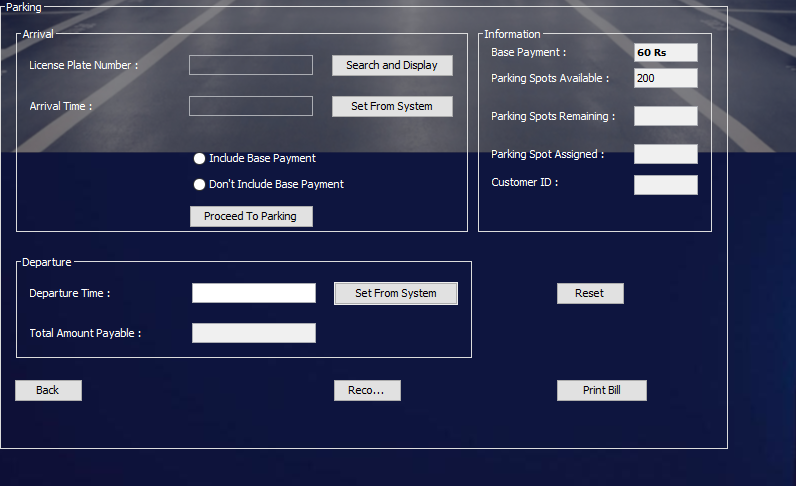

# ParkDynamiX 🚗
**Java DBMS Project for Parking System Management**

**Contributor:** [Charishma](https://github.com/Charishma608)

---

## 🌟 Introduction


Welcome to the **Java-Parking-System**! This project is a comprehensive parking management system designed in Java, aimed at streamlining the process of parking space allocation and fee collection. Our system ensures an efficient and organized parking experience.

### Key Features:
- **Automated Parking Space Assignment**: Assigns parking spaces to incoming vehicles.
- **Timely Record Keeping**: Maintains accurate records of vehicle entry and exit times.
- **Efficient Fee Calculation**: Charges based on the duration of the parking.
- **Administrative Control**: Provides tools for administrators to oversee and manage the system.



---

## 🎯 Project Goals
This project is specifically crafted to:
- **Reduce Management Difficulty**: Simplify the process of managing parking spaces.
- **Enhance Efficiency**: Provide an intuitive interface for both managers and administrators.
- **Ensure Accountability**: Keep precise records to avoid discrepancies.
- **Improve User Experience**: Make the parking process seamless for users.

---

## 🛠️ Installation & Usage

### Prerequisites:
- Java Development Kit (JDK)
- Any Java IDE (IntelliJ IDEA, Eclipse, etc.)

### Steps to Run the Project:
1. **Clone the Repository:**
   ```sh
   [git clone https://github.com/Charishma608/Java-Parking-System.git](https://github.com/Charishma608/ParkDynamiX.git)

# 📬 Contact
For any inquiries or feedback, please contact.

